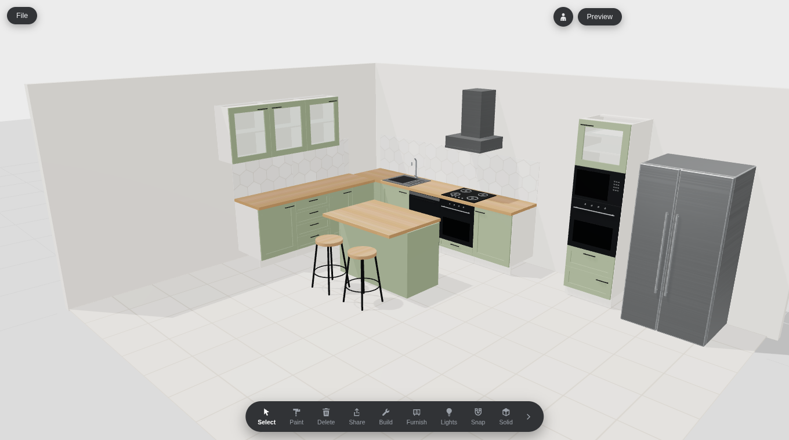

# 3D Kitchen Maker

A web-based parametric kitchen configurator built with Vite, plain JavaScript
and three.js — no frameworks, no downloaded assets (every texture is a seeded
procedural canvas). Users place cabinet runs, tall/wall units, islands,
appliances and stools in a room; every object is generated from parameters; a
side panel edits the selected object live; a paint mode applies materials per
surface via a radial swatch wheel.



## Scripts

| Command | What it does |
| --- | --- |
| `npm run dev` | Vite dev server |
| `npm run build` / `preview` | production build / preview |
| `npm run shot -- --fixture=<name> --views=hero,front,top,close [--out=p]` | headless screenshots into `shots/` |
| `node tools/actions-smoke.mjs` | store-action test suite (node, no browser) |

In the app: **o** toggles cabinet fronts, **f** toggles the FPS/draw-call
overlay, **Escape** exits any mode, **Delete** removes the selection.

## Deploy (GitHub Pages)

The app is a fully static bundle (no server, no external assets), so it hosts
on GitHub Pages. The workflow in `.github/workflows/deploy.yml` builds and
publishes on every push to the default branch. **One-time setup:** in the
repository, open **Settings → Pages → Build and deployment → Source** and
select **GitHub Actions**. The site then serves at
`https://<owner>.github.io/<repo>/`.

Project sites live under `/<repo>/`, so the build needs a matching base path.
The workflow sets it automatically from the repository name via `VITE_BASE`;
locally, `npm run dev` and `npm run build` both default to `/`. To reproduce a
Pages build locally: `VITE_BASE=/<repo>/ npm run build && VITE_BASE=/<repo>/ npm run preview`.

Fixtures are bundled at build time (`import.meta.glob`) rather than fetched
from `/src`, so they resolve correctly under the Pages base path.

## Architecture

Single source of truth: the scene is one JSON document in the store. The 3D
layer is a pure projection of it; the UI writes only through validated
actions (see `CLAUDE.md` for the standing rules).

```
        ┌────────────┐   actions (validated)   ┌───────────────┐
        │  UI layer  │ ───────────────────────► │  state/store   │
        │ toolbar,   │                          │  (Scene JSON)  │
        │ panel,     │ ◄─────────── subscribe ──┴───────┬────────┘
        │ wheel      │                                  │ change
        └─────┬──────┘                          ┌───────▼────────┐
              │ select/hover                    │ core/projection │
        ┌─────▼──────┐    rebuild + dispose     │  (3D layer)     │
        │ interact/  │ ◄──────────────────────► │ per-item groups │
        │ picker,    │                          └───────┬────────┘
        │ gizmo,     │        pure generators           │
        │ placement, │   (params, matLib) => Group      │
        │ snapping,  │  ┌───────────────────────────────▼──┐
        │ ghost,walk │  │ build/ cabinet·run·compartments·  │
        └────────────┘  │ fronts·appliances/*·furniture/*   │
                        └───────────────┬───────────────────┘
                                        │ shared cached materials
                        ┌───────────────▼───────────────────┐
                        │ materials/ library·swatches·       │
                        │ procedural canvas textures         │
                        └────────────────────────────────────┘
```

## Data model (abridged)

```js
Scene = { room: { width, depth, wallHeight, wallColor, floorMaterial }, items: [] }
Run   = { id, kind:'run', unitType:'base'|'wall'|'tall'|'island',
          position:[x,z], rotationY, worktop, plinth, openFronts?, backsplash?,
          materials:{ door, carcass, worktop, handle, plinth? },
          modules:[{ id, type, width, handle, compartments:[
            { id, type:'shelf'|'drawer'|'door'|'oven'|'microwave',
              style:{hinge,glass}, shelvesInside, weight }]}],
          features:[{ id, type:'hob'|'sink'|'tap', offsetX, params }] }
Appliance = { id, kind:'appliance', applianceType:'fridge'|'hood', position, rotationY, params }
Furniture = { id, kind:'furniture', furnitureType:'stool', position, rotationY, params }
```

Units are meters internally; the UI shows cm for cabinets and m for
appliances. Full schema and standard dimensions: `SPEC.md`.

## Features vs. the reference

| Feature | Status |
| --- | --- |
| Parametric shaker cabinets (carcass, doors, drawers, handles, compartment solver) | done |
| Runs with worktop/plinth, wall/tall/island types, module editing panel | done |
| Appliances: fridge (4 types, 6 finishes, open state), hob/sink/tap as worktop features, hood | done |
| Parametric stools + island seating overhang | done |
| Picking, rotation gizmo, drag with grid/wall/run snapping, ghost placement | done |
| Paint mode: radial wheel, 29 swatches, live preview, walls/floor | done |
| Preview auto-orbit + first-person walk mode | done |
| Persistence (localStorage autosave), file menu, JSON import/export | done |
| Hex backsplash | done (optional flag per base run) |
| **Lights** | inferred: the video never shows its behavior; implemented as Day / Warm-evening lighting presets |
| **Solid** | inferred: implemented as clay mode (all items matte white, reversible) |
| **Share** | inferred: implemented as downloads — scene JSON + hero PNG + 4-view contact sheet |
| Per-wall paint, hood auto-align to hob, corner-cabinet interiors | partial / simplified |

## Performance

Reference-kitchen fixture: **313 draw calls** (including the shadow pass;
budget < 350), ~34k triangles, 155 geometries. Static parts (carcasses,
shaker fronts, handles, feature hardware, stool frames) are merged per
logical unit with `BufferGeometryUtils.mergeGeometries`; fronts stay separate
groups so they can animate and repaint. Every rebuild disposes the old
group's geometry and non-shared materials — geometry count is asserted flat
across rebuild loops in the QA suite.
